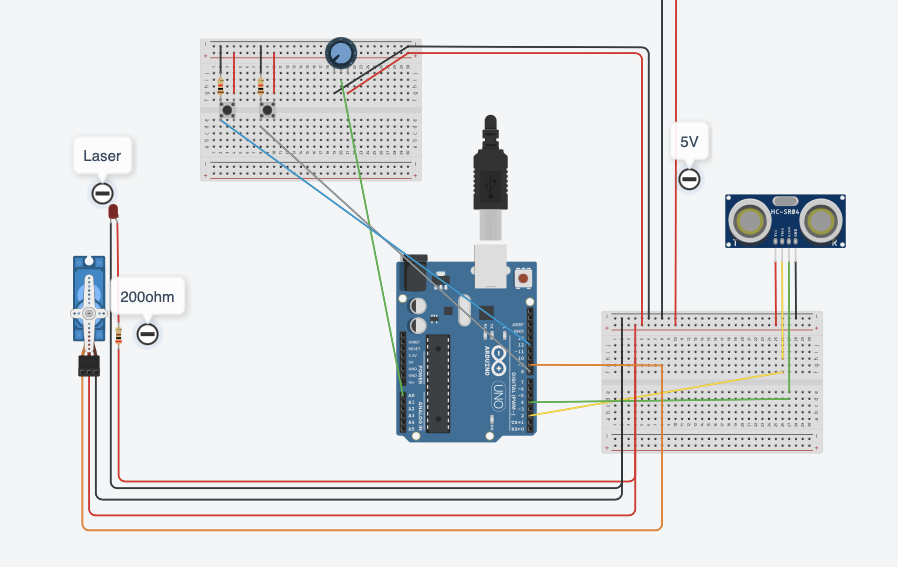

# ParkAssist

Autore: Angelo Sorrentino

Descrizione: il progetto consiste in un sistema che favorisce la precisione durante i parcheggi in luogo chiuso.
Un sensore ad ultra suoni aiuta a pilotare un servo motore, sopra al quale è montato un diodo laser a linea. Quest'ultimo proietta la distanza tra il veicolo e la parete, rispetto ad una linea presa come riferimento (es: lo spigolo tra parete e soffitto).

Componenti HW:
- sensore ad ultra suoni (HC-SR04)
- servo motore (SG90)
- diodo laser a linea
- relé 5V 
- Arduino UNO R3

Link a repo: https://github.com/angsorre/ParkAssist

Licenza scelta: GNU General Public License v3.0

Data *indicativa* di presentazione: fine giugno 2025

### Schema

