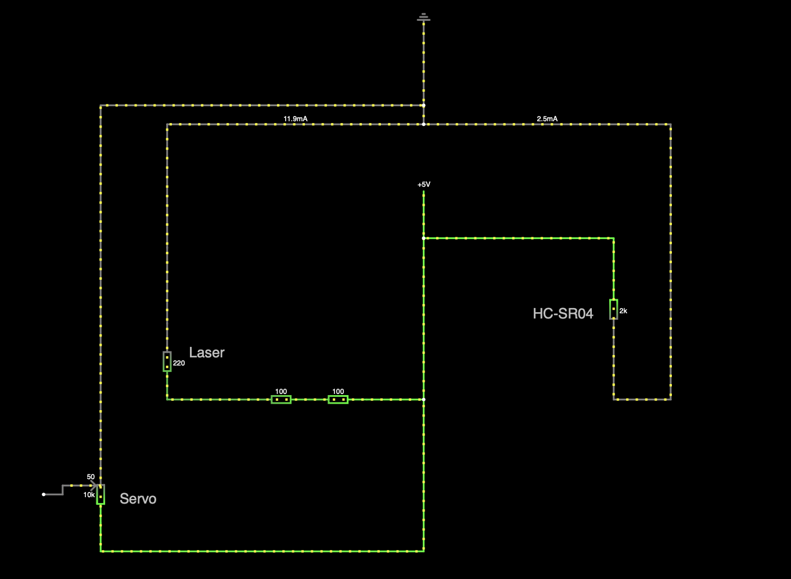

# ParkAssist

Autore: Angelo Sorrentino

Descrizione: il progetto consiste in un sistema che favorisce la precisione durante i parcheggi in luogo chiuso.
Un sensore ad ultra suoni aiuta a pilotare un servo motore, sopra al quale è montato un diodo laser a linea. Quest'ultimo proietta la distanza tra il veicolo e la parete, rispetto ad una linea presa come riferimento (es: lo spigolo tra parete e soffitto).

Componenti HW:
- sensore ad ultra suoni (HC-SR04)
- servo motore (SG90)
- diodo laser a linea
- Arduino UNO R3

Link a repo: https://github.com/angsorre/ParkAssist

Licenza scelta: GNU General Public License v3.0

Data *indicativa* di presentazione: fine giugno 2025

## Schema

### Alimentazione

Salvato nel file [wiring](wiring.txt), importabile in [circuitjs](https://www.falstad.com/circuit/circuitjs.html).

### Installazione
Il laser va montato sul lato destro, all'altezza del riferimento preso in considerazione.

### Calibrazione
La distanza di montaggio del laser dal punto di riferimento è il parametro principale del sistema ed ha valore default di `40cm`. Può essere tuttavia configurato a run-time (nel range `30-100cm`) a seconda dell'esigenze: è sufficiente regolare il potenziometro e tener premuto il pulsante per circa 5s.

È inoltre possibile calibrare la distanza a cui il laser indicherà il limte: ovvero la distanza a cui il laser punterà direttamente la linea di riferimento. Ciò è stato fatto per i casi in cui il sensore non è allineato con la parete.
Per effettuare questa calibrazione posizionare il veicolo alla distanza "zero" desiderata e premere il pulsante per 5s.
